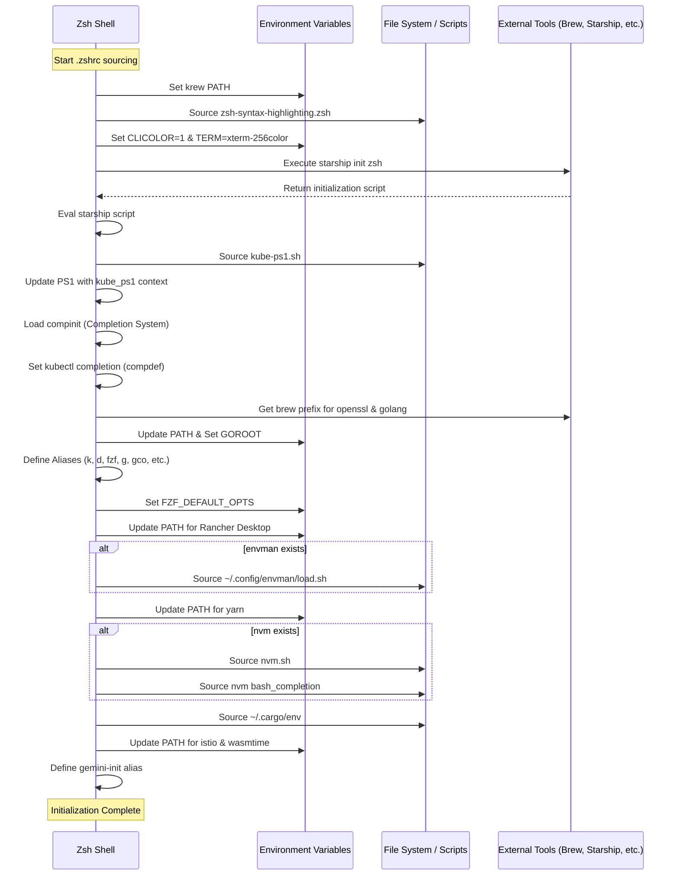

# GEMINI.md

## 1. Project Structure Summary

The `dotfiles` repository is a collection of configuration files used to customize and manage the user's development environment. It primarily targets the Zsh shell and integrates various modern development tools.

### Key Files:
- **`.zshrc`**: The core configuration file for the Zsh shell. It manages:
    - **Environment Variables**: Sets up `PATH` for various tools like `krew`, `openssl`, `golang`, `yarn`, `istio`, and `wasmtime`.
    - **Shell Customization**: Configures syntax highlighting, terminal colors, and the `starship` prompt.
    - **Tool Integration**: Initializes `kube-ps1` for Kubernetes context, `compinit` for completions, and `fzf` for fuzzy searching.
    - **Aliases**: Provides numerous shortcuts for `kubectl`, `docker`, `git`, and `fzf`-based workflows.
    - **Version Managers**: Loads `nvm` (Node Version Manager) and `cargo` (Rust) environments.
- **`.gitignore_global`**: Defines global patterns for Git to ignore, ensuring that temporary or sensitive files are not accidentally tracked across different repositories.
- **`README.md`**: A minimal guide providing the commands to symlink the configuration files to the user's home directory.

---

## 2. Initialization Flow

The following sequence diagram illustrates the initialization process when a new Zsh session is started and `.zshrc` is sourced.

