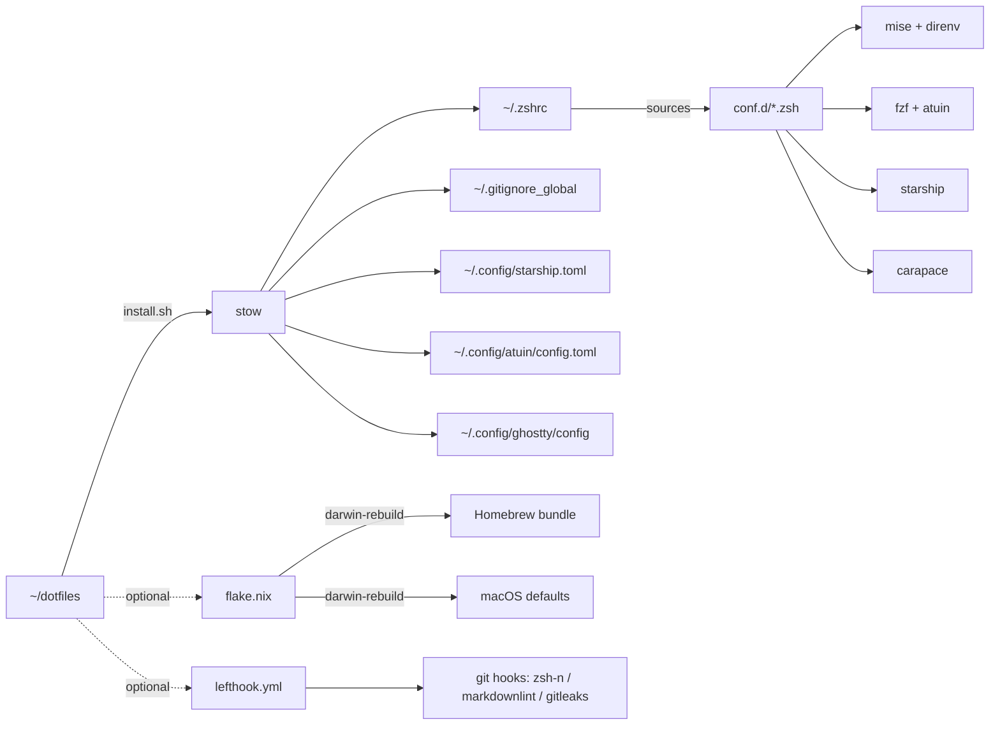

# kanywst / dotfiles

[English](README.md) | **日本語**


[](https://github.com/kanywst/dotfiles/actions/workflows/lint.yml)


## TL;DR

```bash
git clone https://github.com/kanywst/dotfiles.git ~/dotfiles
cd ~/dotfiles && ./install.sh
exec zsh -l
```

`install.sh` は GNU stow の薄いラッパー。`zsh/` / `git/` / `starship/` を
`$HOME` に link し、衝突するファイルは先に `*.backup` へリネームする。

## なぜ

- **プラグインマネージャ不要**: zsh はファイル名順で `conf.d/NN-*.zsh` を読むだけ。壊れる要素も更新する要素もない。
- **ランタイム管理は一本化**: `mise` が node / python / go / rust をグローバルに pin。NVM / pyenv / nodebrew は撤廃。
- **brew の single source of truth**: `flake.nix` が bundle を宣言し、`darwin-rebuild switch` で同期。
- **秘匿情報は tracked ファイルに入れない**: `~/.zshrc.local` を `.zshrc` が最後に source し、gitignore してある。

## 中身

- Rust CLI: eza / bat / fd / ripgrep / delta / btop / zoxide / yazi / xh / ast-grep / procs / dust / sd / hyperfine / tokei / onefetch
- Atuin: sqlite バックエンドの履歴、daemon・workspace フィルタ・`Ctrl-R`
- mise + direnv: ランタイム pin + ディレクトリ単位の env + repo タスク
- uv / bun: 高速な Python + JS パッケージ管理
- nix-darwin: flake 駆動の macOS defaults + brew bundle
- GNU stow: モジュール化した `conf.d` zsh、プラグインマネージャなし
- Starship: プロンプトに k8s / docker / direnv / git ステータス
- fzf + fzf-tab + carapace: 500+ CLI 横断のプレビュー付き補完
- lazygit / lazydocker / k9s: 定番まわりの TUI
- ghq + fzf: `repo` でディスク上のどこへでもジャンプ
- Ghostty: ターミナル設定を tracked (テーマ・split・mac-alt)
- lefthook + gitleaks: 高速並列の pre-commit フック + シークレットスキャン
- aichat: シェル上のマルチモデル LLM CLI
- `work`: 全部まとめて更新する CLI (nix-darwin + brew + rustup/mise/npm/krew/gh)、gum スピナー付き
- jj (Jujutsu): git 互換のモダン VCS、repo ごとに git と colocate
- AeroSpace: i3 ライクなタイル型 WM (SIP 無効化不要)
- Karabiner-Elements: Caps Lock → Hyper Key + hjkl 矢印キー

## スタック

| レイヤ | ツール | 置き換え対象 |
| --- | --- | --- |
| Shell | zsh | - |
| Terminal | ghostty | iTerm2 / Alacritty / wezterm |
| Prompt | starship | oh-my-zsh テーマ |
| Completion | carapace + fzf-tab | ツール別の補完スクリプト |
| History | atuin (daemon) | 素の `history` + Ctrl-R |
| Listing | eza | ls |
| Pager-cat | bat | cat |
| Find | fd | find |
| Grep | ripgrep | grep |
| Sed | sd | sed (安全な書き換え用) |
| Process | procs | ps |
| Disk usage | dust | du |
| Diff | delta | git の diff |
| Top | btop | top / htop |
| Bench | hyperfine | `time` ループ |
| Code stats | tokei | cloc |
| Repo info | onefetch | 手動の `git log` 集計 |
| HTTP | xh | curl / httpie |
| Cd | zoxide | cd + autojump |
| Fuzzy | fzf + fzf-tab | 手動補完 |
| Files TUI | yazi | ranger |
| Multiplex | zellij | tmux |
| Runtime | mise | nvm / pyenv / nodebrew |
| Per-dir env | direnv | 手書きの `.env` source |
| Python pkgs | uv | pip / poetry / virtualenv |
| JS runtime | bun | node + npm + tsx |
| Tasks | mise tasks | Makefile / justfile |
| Hooks | lefthook | husky / pre-commit (Python) |
| Secrets scan | gitleaks | 手動の `grep -i secret` |
| LLM CLI | aichat | API への単発 `curl` |
| VCS | jj (Jujutsu) + git | git 単独 |
| Tile WM | AeroSpace | yabai (SIP 無効が必要) / Magnet |
| Keymap | Karabiner-Elements | macOS システム設定 |
| App Store | mas | 手動の GUI インストール |
| Updater | `work` (bin/) | 場当たり的な `brew upgrade` / `nix flake update` |
| System | nix-darwin | 手動の `defaults write` |
| User env | home-manager (input 結線済み) | stow のみ |
| Linker | GNU stow | 手書きの `ln -s` スクリプト |

## アーキテクチャ



`zsh/conf.d/` は意図的に stow 対象外 (`zsh/.stow-local-ignore`) にして、
`$DOTFILES_ZSH_DIR/conf.d/` から直接 source している。だからローダーは
symlink の形に依存しない。

## インストール

### 1. Clone

```bash
git clone https://github.com/kanywst/dotfiles.git ~/dotfiles
cd ~/dotfiles
```

### 2. Stow

```bash
./install.sh             # link
./install.sh --restow    # symlink がズレたら貼り直し
./install.sh --delete    # アンインストール
```

stow が未インストールなら `brew install stow` を自動で打つ。conflict した
ファイルは `*.backup` にリネームしてから link する。

### 3. ツール導入

```bash
# Core
brew install git gh ghq fzf jq yq stow direnv mas

# Rust-flavoured CLI
brew install starship zoxide eza bat fd ripgrep git-delta btop atuin xh \
             ast-grep yazi zellij procs dust sd hyperfine tokei onefetch \
             zstd

# Runtime + package managers
brew install mise uv bun

# Completion + hooks + security + lint
brew install carapace lefthook gitleaks shellcheck actionlint

# LLM CLI
brew install aichat

# Modern VCS + tile WM + keymap
brew install jj
brew install --cask nikitabobko/tap/aerospace karabiner-elements

# Zsh plugins
brew install zsh-autosuggestions zsh-syntax-highlighting fzf-tab

# Git / k8s / docker TUI
brew install lazygit lazydocker kubectl kubectx kubecolor k9s krew
gh extension install dlvhdr/gh-dash

# Nerd font (Starship が要求)
brew install --cask font-hack-nerd-font
```

### 4. ランタイムを pin

```bash
mise use -g node@lts python@3.13 go@latest rust
```

### 5. Repo タスク + フック

```bash
mise tasks ls           # repo レベルの mise タスク一覧
mise run lint           # zsh -n + shellcheck + markdownlint + actionlint
mise run install        # ./install.sh
mise run darwin-switch  # darwin-rebuild switch
mise run bootstrap      # brew 外の層を導入 (mise/rustup/krew/gh ext)
mise run hooks          # lefthook install (.git/hooks/* を書く)
mise run scan           # ツリー全体に gitleaks detect
```

`lefthook.yml` は pre-commit で zsh-syntax / shellcheck / markdownlint /
`gitleaks protect --staged` を、pre-push で `actionlint` + `nix flake check`
を走らせる。

### 6. ローカルの秘匿情報

```bash
cat > ~/.zshrc.local <<'EOF'
export GEMINI_API_KEY="..."
export OPENAI_API_KEY="..."
EOF
chmod 600 ~/.zshrc.local
```

### 7. (任意) nix-darwin

`flake.nix` は macOS の system defaults と Homebrew bundle を宣言的に管理
する。`username` は `builtins.getEnv "USER"` で実行時に解決するので、リポ
にアカウント名を埋め込まない。実際の switch は `$USER` を読むため `--impure`
が要る。pure eval (`nix flake check`) は `user` にフォールバックする。
`#"$(whoami)"` で自分の構成を選ぶ。

```bash
sudo nix run github:LnL7/nix-darwin/master#darwin-rebuild -- switch \
  --flake ~/dotfiles#"$(whoami)"

darwin-rebuild switch --flake ~/dotfiles#"$(whoami)"
```

何が起きるか:

- `system.defaults` の項目 → `defaults write` 相当が走る (Dock 自動隠し、Dark Mode、Finder の隠しファイル表示 など)
- `homebrew.brews / casks / masApps` のリストに対して `brew install`。これらは実機の `brew leaves` / `brew list --cask` / `mas list` をミラーしているので、新しい Mac でも同じソフト構成に収束する (`cleanup = "none"` なのでリスト外は消さない)
- `~/.zshrc` / `~/.config/starship.toml` は触らない (stow の管轄)

`mas` セクションはデフォルトでスキップされる (`HOMEBREW_BUNDLE_MAS_SKIP` に `flake.nix` の `masApps` の id を流し込んでいる)。`brew bundle` は App Store アプリが入っているかを `mas list` に聞き、mas 7 はそれを Spotlight インデックスから答える。`/Applications` がインデックスされていないマシンでは全エントリが「未インストール」に見え、switch のたびに `mas install` が走ってアプリを再ダウンロードし、activation が失敗する。新しい Mac のように本当に入っていない場合だけ、`DARWIN_MAS=1` を付けて一度 switch する:

```bash
DARWIN_MAS=1 darwin-rebuild switch --impure --flake ~/dotfiles#"$(whoami)"
```

やめる時:

```bash
sudo nix run github:LnL7/nix-darwin/master#darwin-uninstaller
```

### 8. brew 外の層

flake で宣言できない管理系 (mise runtime、rustup toolchain、krew プラグイン、
gh 拡張) がある。`bootstrap` がそれらを冪等に導入する (再実行は不足分だけ埋める)。
更新はあとで `work` が面倒を見る。

```bash
mise run bootstrap   # または: bootstrap
```

## 日常リファレンス

### ナビゲーション

| Cmd | 動作 |
| --- | --- |
| `cd foo` | zoxide の frecency ジャンプ |
| `..` / `...` / `....` | `cd ../..` など |
| `mkcd dir` | `mkdir -p && cd` |
| `Alt-C` | fzf ディレクトリ選択 |
| `Ctrl-T` | fzf ファイル選択 (挿入) |

### リスト & 表示

| Cmd | 動作 |
| --- | --- |
| `ls` / `ll` / `la` / `lt` / `ltt` | eza のバリエーション |
| `cat` | bat |
| `top` | btop |
| `ps` | procs |
| `du` | dust |
| `diff` | delta |
| `tree` | eza --tree |

### Git

| Cmd | 動作 |
| --- | --- |
| `gs` / `gst` | status (短縮 / 詳細) |
| `ga` / `gap` | add / patch-add |
| `gc` / `gcm` / `gcs` | commit / -m / -s |
| `gca` / `gcan` | amend / amend --no-edit |
| `gd` / `gdc` | diff / diff --cached |
| `gl` / `gla` / `glo` | log グラフ / + all / 直近20件 |
| `gco` / `gcb` | checkout / -b |
| `gsw` / `gswc` | switch / switch -c |
| `gb` / `gbd` | branch / branch -d |
| `gp` / `gpf` | push / push --force-with-lease |
| `gpl` / `gfa` | pull --rebase / fetch --all --prune |
| `gss` / `gsp` | stash / stash pop |
| `gwl` / `gwa` / `gwr` | worktree list / add / remove |
| `gcv` / `gcam` | commit -v / commit -a -m |
| `gcf` / `gri` / `grc` / `gra` | commit --fixup / rebase -i / --continue / --abort |
| `lg` | lazygit |

### Jujutsu (jj), git 互換

| Cmd | 動作 |
| --- | --- |
| `jjs` / `jjl` / `jjll` | status / log / log no-pager |
| `jjn` / `jje` / `jjd` | new / edit / diff |
| `jjp` / `jjf` | git push / git fetch --all-remotes |
| `jjsq` / `jjab` | squash / abandon |

既存の git repo 内で jj を初期化 (colocated):

```bash
cd <repo> && jj git init --colocate
```

### Git + fzf

| Cmd | 動作 |
| --- | --- |
| `gcof` | fzf でブランチ checkout (log プレビュー) |
| `gwt` | fzf で worktree ジャンプ |
| `repo` / `g` | ghq + fzf で repo ジャンプ |

### GitHub CLI

| Cmd | 動作 |
| --- | --- |
| `ghco` | fzf で PR checkout |
| `ghpr` | `gh pr create --web` |
| `ghprl` / `ghprv` | PR 一覧 / web で表示 |
| `ghd` | `gh dash` |

### Docker

| Cmd | 動作 |
| --- | --- |
| `d` | docker |
| `dc` / `dcu` / `dcd` | compose / up -d / down |
| `dcl` / `dcb` / `dcr` | logs -f / build / restart |
| `dps` / `dpsa` / `dimg` | 整形 ps / ps -a / images |
| `dprune` | system prune -af --volumes |
| `ld` | lazydocker |

### Kubernetes

| Cmd | 動作 |
| --- | --- |
| `k` | kubecolor (色付き kubectl) |
| `ktx` / `kns` / `kkn` | kubectx / kubens / namespace 設定 |
| `kgp` / `kgpa` | get pods / -A |
| `kgs` / `kgd` / `kgi` / `kgn` / `kga` | get svc / deploy / ing / nodes / all |
| `kge` | 時刻順の events |
| `kdp` / `kds` / `kdd` | describe pod / svc / deploy |
| `kl` / `klf` / `klp` | logs / -f / --previous |
| `kex` / `kpf` | exec -it / port-forward |
| `kaf` / `kdf` | apply -f / delete -f |
| `kw` | watch pods |
| `k9` | k9s TUI |
| `kex-fzf` / `klog-fzf` | fzf で pod 選択 → exec / logs |

### ランタイム / パッケージマネージャ

| Cmd | 動作 |
| --- | --- |
| `m` / `mr` / `mt` / `mu` / `ml` | mise / run / tasks ls / use / ls |
| `uvr` / `uva` / `uvs` / `uvi` / `uvp` | uv run / add / sync / init / pip |
| `br` / `bi` / `ba` / `bre` / `bd` / `bt` | bun run / install / add / remove / dev / test |

### AI + フック + ベンチ

| Cmd | 動作 |
| --- | --- |
| `ai` | aichat (マルチモデル LLM) |
| `ask "<task>"` | aichat -e: 自然言語 → シェル |
| `lh` | lefthook |
| `glk` | gitleaks detect (redacted) |
| `hf` | hyperfine ベンチ |
| `onef` | onefetch の repo サマリ |
| `ast` | atuin stats |

### 関数

| Cmd | 動作 |
| --- | --- |
| `mkcd <dir>` | mkdir + cd |
| `groot` | git の toplevel へジャンプ |
| `extract <file>` | アーカイブ展開を自動判別 (tar/zip/zst/7z/…) |
| `port <num>` | そのポートを listen しているプロセス |
| `killport <num>` | その listener を kill |
| `gi <stack>` | gitignore.io フェッチャ |
| `fkill` | fzf でプロセス kill |
| `avg [path]` | Antigravity で開く |

### システム

| Cmd | 動作 |
| --- | --- |
| `ports` | listen 中のポート |
| `myip` / `localip` | グローバル / en0 IP |
| `path` | `$PATH` を1行ずつ |
| `pbjson` | クリップボードの JSON を整形 |
| `flushdns` | macOS の DNS キャッシュフラッシュ |
| `showfiles` / `hidefiles` | Finder の隠しファイル表示トグル |
| `reload` / `sz` / `ez` | シェル再読込 / source / zshrc 編集 |

### 更新

`work` (`bin` stow パッケージ、`~/.local/bin/work` にリンク) で全部まとめて上げる。
このマシンは nix-darwin の宣言的構成なので、システムの正規経路は `brew upgrade`
単体ではなく `nix flake update` + `darwin-rebuild switch`。nix が管理しないユーザー
領域のマネージャもこれに合わせて更新する。各ステップの出力は gum スピナーの裏に隠れ、
失敗したときだけ表示される。

| Cmd | 動作 |
| --- | --- |
| `work` | 全部更新: nix-darwin → brew → rustup → mise → npm-g → krew → gh ext → atuin |
| `work -v` | 同上、各コマンドの出力をライブ表示 |
| `work -h` | ヘルプ |

sudo は最初に一度だけ要求 (nix-darwin switch 用)。`cargo`/`go` バイナリは一括更新
手段が無いので意図的に対象外。

各ステップには watchdog が付く (`WORK_TIMEOUT`、デフォルト `1800` 秒、`0` で無効)。spinner がステップの出力を隠すので、ハングは画面上「何も起きない」に見える。上限を設けることで、静かに 1 時間溶かす代わりに 1 ステップの失敗として扱い、残りのステップはそのまま走る。

### キーバインド

| Key | 動作 |
| --- | --- |
| `Ctrl-R` | Atuin の全文履歴 |
| `Ctrl-T` | fzf でファイル挿入 |
| `Alt-C` | fzf で cd |
| `Ctrl-/` | fzf プレビュー切替 |
| `↑` / `↓` | prefix 検索の履歴 |
| `Ctrl-←` / `Ctrl-→` | 単語ジャンプ |
| `Ctrl-X Ctrl-E` | 現在のコマンドラインを `$EDITOR` で編集 |
| `Caps Lock` (タップ) | Escape (Karabiner) |
| `Caps Lock` (長押し) | Hyper Key (cmd+ctrl+opt+shift) |
| `Hyper + h/j/k/l` | 矢印キー |

### AeroSpace (タイル型 WM)

| Key | 動作 |
| --- | --- |
| `Alt + h/j/k/l` | フォーカス 左/下/上/右 |
| `Alt-Shift + h/j/k/l` | ウィンドウ移動 |
| `Alt + 1..9` | ワークスペース切替 |
| `Alt-Shift + 1..9` | ウィンドウを別ワークスペースへ |
| `Alt + /` / `,` | tiles / accordion レイアウト |
| `Alt + f` | フルスクリーン |
| `Alt-Shift + space` | floating / tiling トグル |
| `Alt-Shift + q` | ウィンドウを閉じる |
| `Alt-Shift + c` | AeroSpace 設定を再読込 |

## 設計メモ

- `.zshrc` は 30行のローダー。本体は `zsh/conf.d/NN-*.zsh`。プレフィックスが読込順を決める (`00-env` → `99-local`)。
- `typeset -U path PATH` が `PATH` を自動で重複排除。
- NVM / nodebrew / pyenv は撤廃。走るのは `mise activate zsh` のみ。
- `$BREW_PREFIX` はシェルごとに1回キャッシュして `brew --prefix` の 50-100 ms を省く。
- `compinit` の dump 再構築は最大でも24時間に1回。
- Atuin は Ctrl-R のみ担当 (`--disable-up-arrow`)。↑ は zsh の prefix 検索のまま。
- `conf.d/` は stow 対象外で `$DOTFILES_ZSH_DIR/conf.d/` から source。
- 秘匿情報は `~/.zshrc.local` に置き、gitignore して tracked にしない。

## トラブルシューティング

シェルが遅い:

```bash
time zsh -i -c exit
zsh -xvs 2>&1 | ts -i "%.s" | sort -nr | head -20
```

プラグインが読まれない:

```bash
echo "$BREW_PREFIX"
ls "$BREW_PREFIX/share/zsh-autosuggestions/"
ls "$BREW_PREFIX/share/zsh-syntax-highlighting/"
```

補完が古い:

```bash
rm -f "$XDG_CACHE_HOME/zsh/zcompdump-"*
exec zsh -l
```

## ライセンス

MIT.
