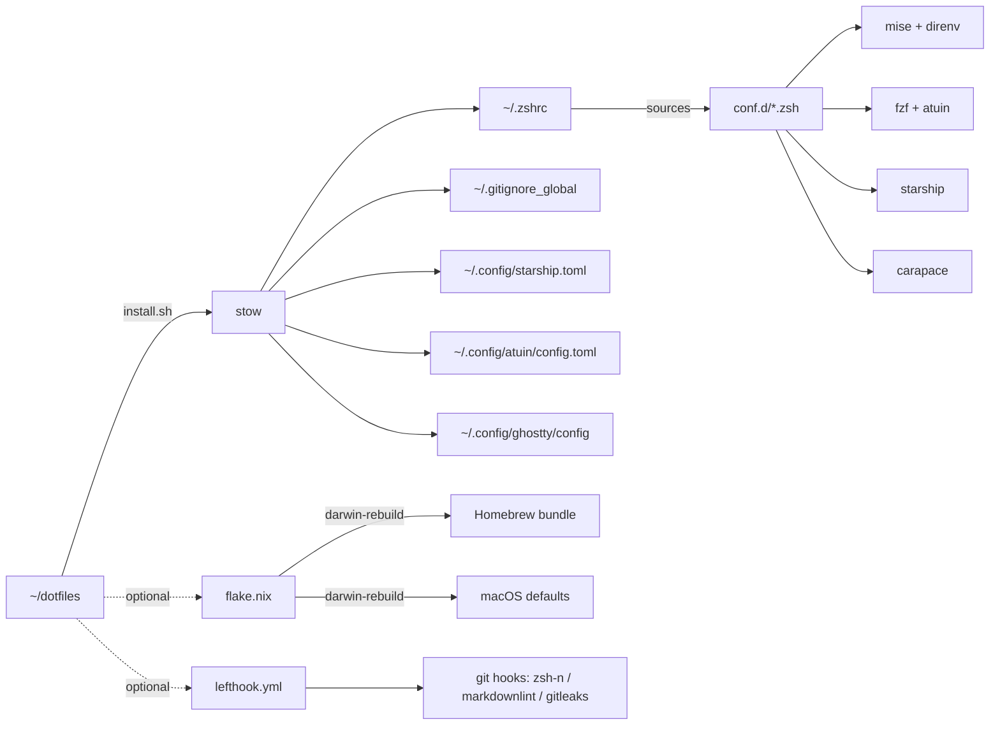

# kanywst / dotfiles

**English** | [日本語](README.ja.md)


[](https://github.com/kanywst/dotfiles/actions/workflows/lint.yml)


## TL;DR

```bash
git clone https://github.com/kanywst/dotfiles.git ~/dotfiles
cd ~/dotfiles && ./install.sh
exec zsh -l
```

`install.sh` is a thin GNU-stow wrapper. It links `zsh/`, `git/`,
`starship/` into `$HOME` and renames any colliding file to `*.backup` first.

## Why

- **No plugin-manager runtime**: zsh loads `conf.d/NN-*.zsh` by filename order. Nothing to break, nothing to update.
- **One runtime manager**: `mise` pins node / python / go / rust globally. NVM / pyenv / nodebrew retired.
- **One brew source of truth**: `flake.nix` declares the bundle. `darwin-rebuild switch` reconciles.
- **Secrets never enter tracked files**: `~/.zshrc.local` is sourced last by `.zshrc` and gitignored.

## What's inside

- Rust CLI: eza / bat / fd / ripgrep / delta / btop / zoxide / yazi / xh / ast-grep / procs / dust / sd / hyperfine / tokei / onefetch
- Atuin: sqlite-backed history with daemon, workspace filter, `Ctrl-R`
- mise + direnv: runtime pinning + per-directory env + repo tasks
- uv / bun: fast Python + JS package management
- nix-darwin: flake-driven macOS defaults + brew bundle
- GNU stow: modular `conf.d` zsh, no plugin manager
- Starship: k8s / docker / direnv / git status in the prompt
- fzf + fzf-tab + carapace: preview-driven completion across 500+ CLIs
- lazygit / lazydocker / k9s: TUIs for the obvious things
- ghq + fzf: `repo` jumps to anything on disk
- Ghostty: terminal config tracked (theme, splits, mac-alt)
- lefthook + gitleaks: fast parallel pre-commit hooks + secret scanning
- aichat: multi-model LLM CLI in the shell
- `bump`: one-shot "update everything" CLI (nix-darwin + brew + rustup/mise/npm/krew/gh/cargo/go) with gum spinners
- jj (Jujutsu): git-compatible modern VCS, colocated with git per-repo
- Karabiner-Elements: Caps Lock → Hyper Key + hjkl arrow keys

## Stack

| Layer | Tool | Replaces |
| --- | --- | --- |
| Shell | zsh | - |
| Terminal | ghostty | iTerm2 / Alacritty / wezterm |
| Prompt | starship | oh-my-zsh themes |
| Completion | carapace + fzf-tab | per-tool completion scripts |
| History | atuin (daemon) | bare `history` + Ctrl-R |
| Listing | eza | ls |
| Pager-cat | bat | cat |
| Find | fd | find |
| Grep | ripgrep | grep |
| Sed | sd | sed (for safe rewrites) |
| Process | procs | ps |
| Disk usage | dust | du |
| Diff | delta | git's diff |
| Top | btop | top / htop |
| Bench | hyperfine | `time` loops |
| Code stats | tokei | cloc |
| Repo info | onefetch | manual `git log` summaries |
| HTTP | xh | curl / httpie |
| Cd | zoxide | cd + autojump |
| Fuzzy | fzf + fzf-tab | manual completion |
| Files TUI | yazi | ranger |
| Multiplex | zellij | tmux |
| Runtime | mise | nvm / pyenv / nodebrew |
| Per-dir env | direnv | hand-rolled `.env` sourcing |
| Python pkgs | uv | pip / poetry / virtualenv |
| JS runtime | bun | node + npm + tsx |
| Tasks | mise tasks | Makefile / justfile |
| Hooks | lefthook | husky / pre-commit (Python) |
| Secrets scan | gitleaks | manual `grep -i secret` |
| LLM CLI | aichat | one-off `curl` to API |
| VCS | jj (Jujutsu) + git | git alone |
| Keymap | Karabiner-Elements | macOS System Settings |
| App Store | mas | manual GUI installs |
| Updater | `bump` (bin/) | ad-hoc `brew upgrade` / `nix flake update` runs |
| System | nix-darwin | manual `defaults write` |
| User env | home-manager (input wired) | stow only |
| Linker | GNU stow | hand-rolled `ln -s` scripts |

## Architecture



`zsh/conf.d/` is intentionally excluded from stow
(`zsh/.stow-local-ignore`) and sourced directly from
`$DOTFILES_ZSH_DIR/conf.d/`, so the loader is indifferent to symlink shape.

## Install

### 1. Clone

```bash
git clone https://github.com/kanywst/dotfiles.git ~/dotfiles
cd ~/dotfiles
```

### 2. Stow

```bash
./install.sh             # link
./install.sh --restow    # re-link if symlinks drift
./install.sh --delete    # uninstall
```

If stow isn't installed, `brew install stow` runs automatically. Conflicting
files are renamed to `*.backup` before linking.

### 3. Tooling

```bash
# Core
brew install git gh ghq fzf jq yq stow direnv mas

# Rust-flavoured CLI
brew install starship zoxide eza bat fd ripgrep git-delta btop atuin xh \
             ast-grep yazi zellij procs dust sd hyperfine tokei onefetch \
             zstd

# Runtime + package managers
brew install mise uv bun

# Completion + hooks + security + lint
brew install carapace lefthook gitleaks shellcheck actionlint

# LLM CLI
brew install aichat

# Modern VCS + keymap
brew install jj
brew install --cask karabiner-elements

# Zsh plugins
brew install zsh-autosuggestions zsh-syntax-highlighting fzf-tab

# Git / k8s / docker TUI
brew install lazygit lazydocker kubectl kubectx kubecolor k9s krew
gh extension install dlvhdr/gh-dash

# Nerd font (Starship requires it)
brew install --cask font-hack-nerd-font
```

### 4. Pin runtimes

```bash
mise use -g node@lts python@3.13 go@latest rust
```

### 5. Repo tasks + hooks

```bash
mise tasks ls           # list repo-level mise tasks
mise run lint           # zsh -n + shellcheck + markdownlint + actionlint
mise run install        # ./install.sh
mise run darwin-switch  # darwin-rebuild switch
mise run bootstrap      # install non-brew layers (mise/rustup/krew/gh ext)
mise run hooks          # lefthook install (writes .git/hooks/*)
mise run scan           # gitleaks detect on the full tree
mise run test           # bump regression suite, under bash 5 and bash 3.2
```

`lefthook.yml` runs zsh-syntax, shellcheck, markdownlint, and
`gitleaks protect --staged` on pre-commit; `actionlint`, `nix flake check` and
the `bump` regression suite on pre-push.

### 6. Local secrets

```bash
cat > ~/.zshrc.local <<'EOF'
export GEMINI_API_KEY="..."
export OPENAI_API_KEY="..."
EOF
chmod 600 ~/.zshrc.local
```

### 7. (Optional) nix-darwin

`flake.nix` declaratively manages macOS system defaults and the Homebrew
bundle. `username` is resolved at runtime via `builtins.getEnv "USER"`, so no
account name is baked into the repo. Real switches need `--impure` to read
your `$USER`; pure eval (`nix flake check`) falls back to `user`. Select your
config with `#"$(whoami)"`.

```bash
sudo nix run github:LnL7/nix-darwin/master#darwin-rebuild -- switch \
  --flake ~/dotfiles#"$(whoami)"

darwin-rebuild switch --flake ~/dotfiles#"$(whoami)"
```

What it does:

- `system.defaults` entries → the equivalent `defaults write` runs (Dock autohide, Dark Mode, Finder hidden files, etc.)
- `brew install` against the `homebrew.brews / casks / masApps` lists. These mirror `brew leaves` / `brew list --cask` / `mas list` on the live machine, so a fresh Mac reconciles to the same software set (`cleanup = "none"`, so anything off-list is left alone)
- `~/.zshrc` / `~/.config/starship.toml` are left untouched (stow's territory)

The `mas` section is skipped by default (`HOMEBREW_BUNDLE_MAS_SKIP`, set from the `masApps` ids in `flake.nix`). `brew bundle` asks `mas list` whether an App Store app is installed, and mas 7 answers from the Spotlight index; when `/Applications` isn't indexed every entry looks missing and each switch re-runs `mas install` on all of them, re-downloading apps and failing the activation. On a fresh Mac, where the apps really are absent, run the switch once with `DARWIN_MAS=1` to let mas install them:

```bash
DARWIN_MAS=1 darwin-rebuild switch --impure --flake ~/dotfiles#"$(whoami)"
```

To uninstall:

```bash
sudo nix run github:LnL7/nix-darwin/master#darwin-uninstaller
```

### 8. Non-brew layers

Some managers can't be declared in the flake — mise runtimes, rustup
toolchains, krew plugins, gh extensions. `bootstrap` installs them
idempotently (re-running only fills gaps); `bump` keeps them updated later.

```bash
mise run bootstrap   # or: bootstrap
```

## Daily-driver reference

### Navigation

| Cmd | Action |
| --- | --- |
| `cd foo` | zoxide frecency jump |
| `..` / `...` / `....` | `cd ../..` etc. |
| `mkcd dir` | `mkdir -p && cd` |
| `Alt-C` | fzf dir picker |
| `Ctrl-T` | fzf file picker (insert) |

### Listing & viewing

| Cmd | Action |
| --- | --- |
| `ls` / `ll` / `la` / `lt` / `ltt` | eza variants |
| `cat` | bat |
| `top` | btop |
| `ps` | procs |
| `du` | dust |
| `diff` | delta |
| `tree` | eza --tree |

### Git

| Cmd | Action |
| --- | --- |
| `gs` / `gst` | status (short / full) |
| `ga` / `gap` | add / patch-add |
| `gc` / `gcm` / `gcs` | commit / -m / -s |
| `gca` / `gcan` | amend / amend --no-edit |
| `gd` / `gdc` | diff / diff --cached |
| `gl` / `gla` / `glo` | log graph / + all / last 20 |
| `gco` / `gcb` | checkout / -b |
| `gsw` / `gswc` | switch / switch -c |
| `gb` / `gbd` | branch / branch -d |
| `gp` / `gpf` | push / push --force-with-lease |
| `gpl` / `gfa` | pull --rebase / fetch --all --prune |
| `gss` / `gsp` | stash / stash pop |
| `gwl` / `gwa` / `gwr` | worktree list / add / remove |
| `gcv` / `gcam` | commit -v / commit -a -m |
| `gcf` / `gri` / `grc` / `gra` | commit --fixup / rebase -i / --continue / --abort |
| `lg` | lazygit |

### Jujutsu (jj), git-compatible

| Cmd | Action |
| --- | --- |
| `jjs` / `jjl` / `jjll` | status / log / log no-pager |
| `jjn` / `jje` / `jjd` | new / edit / diff |
| `jjp` / `jjf` | git push / git fetch --all-remotes |
| `jjsq` / `jjab` | squash / abandon |

Initialise jj inside an existing git repo (colocated):

```bash
cd <repo> && jj git init --colocate
```

### Git + fzf

| Cmd | Action |
| --- | --- |
| `gcof` | fzf branch checkout (log preview) |
| `gwt` | fzf worktree jump |
| `repo` / `g` | ghq + fzf repo jump |

### GitHub CLI

| Cmd | Action |
| --- | --- |
| `ghco` | fzf PR checkout |
| `ghpr` | `gh pr create --web` |
| `ghprl` / `ghprv` | PR list / view web |
| `ghd` | `gh dash` |

### Docker

| Cmd | Action |
| --- | --- |
| `d` | docker |
| `dc` / `dcu` / `dcd` | compose / up -d / down |
| `dcl` / `dcb` / `dcr` | logs -f / build / restart |
| `dps` / `dpsa` / `dimg` | formatted ps / ps -a / images |
| `dprune` | system prune -af --volumes |
| `ld` | lazydocker |

### Kubernetes

| Cmd | Action |
| --- | --- |
| `k` | kubecolor (color kubectl) |
| `ktx` / `kns` / `kkn` | kubectx / kubens / set ns |
| `kgp` / `kgpa` | get pods / -A |
| `kgs` / `kgd` / `kgi` / `kgn` / `kga` | get svc / deploy / ing / nodes / all |
| `kge` | events sorted by time |
| `kdp` / `kds` / `kdd` | describe pod / svc / deploy |
| `kl` / `klf` / `klp` | logs / -f / --previous |
| `kex` / `kpf` | exec -it / port-forward |
| `kaf` / `kdf` | apply -f / delete -f |
| `kw` | watch pods |
| `k9` | k9s TUI |
| `kex-fzf` / `klog-fzf` | fzf pod picker → exec / logs |

### Runtime / package managers

| Cmd | Action |
| --- | --- |
| `m` / `mr` / `mt` / `mu` / `ml` | mise / run / tasks ls / use / ls |
| `uvr` / `uva` / `uvs` / `uvi` / `uvp` | uv run / add / sync / init / pip |
| `br` / `bi` / `ba` / `bre` / `bd` / `bt` | bun run / install / add / remove / dev / test |

### AI + hooks + bench

| Cmd | Action |
| --- | --- |
| `ai` | aichat (multi-model LLM) |
| `ask "<task>"` | aichat -e: natural language → shell |
| `lh` | lefthook |
| `glk` | gitleaks detect (redacted) |
| `hf` | hyperfine benchmark |
| `onef` | onefetch repo summary |
| `ast` | atuin stats |

### Functions

| Cmd | Action |
| --- | --- |
| `mkcd <dir>` | mkdir + cd |
| `groot` | jump to git toplevel |
| `extract <file>` | auto-detect archive extractor (tar/zip/zst/7z/…) |
| `port <num>` | who's listening on a port |
| `killport <num>` | kill the listener |
| `gi <stack>` | gitignore.io fetcher |
| `fkill` | fzf process killer |
| `avg [path]` | open in Antigravity |

### System

| Cmd | Action |
| --- | --- |
| `ports` | listening ports |
| `myip` / `localip` | global / en0 IP |
| `path` | `$PATH` one-per-line |
| `pbjson` | format clipboard JSON |
| `flushdns` | macOS DNS cache flush |
| `showfiles` / `hidefiles` | Finder hidden toggle |
| `reload` / `sz` / `ez` | reload shell / source / edit zshrc |

### Updating

`bump` (in the `bin` stow package, linked to `~/.local/bin/bump`) bumps
everything in one run. This box is nix-darwin declarative, so the system path is
`nix flake update` + `darwin-rebuild switch` — not a bare `brew upgrade`; the
per-user managers nix doesn't own are bumped alongside it.

Steps run in two phases. The ordered, root-hungry ones go first and serially
(`flake` → `darwin` → `brew` → `brew-cask`); everything after that is
independent, so it runs concurrently and each result prints the moment that
tool finishes. Output goes to `~/.cache/bump/<timestamp>-<pid>/<step>.log` rather
than the screen — a failing step gets its log tail printed inline, and the last
20 runs are kept.

The summary ranks the steps that ran by how long they took, so the one that ate
most of the wall clock is obvious rather than buried in a list of a dozen names;
anything under a second collapses into a single count. The box is sized to the
terminal, since gum grows a box to its longest line and does not wrap.

| Cmd | Action |
| --- | --- |
| `bump` | update everything: flake → nix-darwin → brew → casks → rustup/mise/npm-g/krew/gh/atuin/cargo/go |
| `bump -n` | show the plan and what would be skipped, run nothing |
| `bump --only nix,brew` | run only these steps |
| `bump --skip atuin` | run everything except these |
| `bump -l` | list the step names |
| `bump -V` | print the version and the revision it came from |
| `bump -v` | stream every command's output live (forces serial) |
| `bump -h` | help |

Sudo is requested once up front, and only when a selected step actually needs
it — `bump --only npm` never prompts. If the grant doesn't take, the steps that
need root (`darwin`, `brew-cask`) are skipped cleanly and the rest still run.

`cargo`/`go` binaries are covered by the `cargo` and `gup` steps, which skip
themselves unless [`cargo-update`][cargo-update] / [`gup`][gup] are installed.

[cargo-update]: https://github.com/nabijaczleweli/cargo-update
[gup]: https://github.com/nao1215/gup

`tests/bump.test.sh` is the regression suite: every assertion there is a bug
that actually shipped. It stubs every manager onto a temp `PATH` and redirects
`XDG_CACHE_HOME` / `DOTFILES_DIR`, so it touches nothing real and needs no
network. It runs on pre-push, in CI, and via `mise run test` — which runs it
twice, the second time under `/bin/bash`, because macOS's bash 3.2 is what
`#!/usr/bin/env bash` finds on a fresh Mac and it is stricter about empty
arrays under `set -u`. `BUMP_TEST_SLOW=1` adds the branches a normal run never
reaches — the sudo keep-alive's 60-second refresh, the watchdog's SIGKILL
escalation, and the deadline that ends the parallel poll when a child never
reports — for a few minutes more.

`tests/trust-coverage.sh` is a static check, not part of that suite: it reads
`flake.nix` and the vendored Homebrew trust store and asserts that every
third-party `owner/tap/name` appears in both, plus in the `taps` list. It runs
on pre-commit, in CI and via `mise run test`. It is a backstop rather than a
live guard — nix-darwin already emits every declared entry as `trusted: true`
in the Brewfile it generates, so the invariant holds for free today, and this
is what notices if that ever stops. The failure it descends from (Homebrew 7
refusing to load an *undeclared* formula from an untrusted tap, which killed
both the switch and the brew step of one run) is caught by `bump`'s
`brew_trust_probe` instead, since nothing in the repo can see a hand-install.

`tests/mutation.sh` measures whether that suite is worth anything: it breaks one
behaviour of `bump` at a time and checks the suite notices. A mutation that
survives is a hole. It refuses to run against a failing baseline, because on a
red suite every mutation looks caught — that produced a confident 15/15 once
while the real number was 10/15. `--show` prints what each mutation actually
changes, which is how two mutations that were quietly testing nothing were
found.

Each step is capped by a watchdog (`BUMP_TIMEOUT`, default `1800` seconds, `0` disables). Output is captured to a log rather than the screen, so a stall shows as nothing at all; the cap turns it into one failed step instead of a silent hour, and the remaining steps still run. It needs `timeout(1)` from `coreutils` (declared in the Brewfile for exactly this); if that's missing the run prints a warning and the steps go unbounded. The nix-darwin step does its work through `sudo`, so the watchdog frees the run but can't reap the root-owned child.

### Key bindings

| Key | Action |
| --- | --- |
| `Ctrl-R` | Atuin full-text history |
| `Ctrl-T` | fzf file insert |
| `Alt-C` | fzf cd |
| `Ctrl-/` | fzf preview toggle |
| `↑` / `↓` | prefix-search history |
| `Ctrl-←` / `Ctrl-→` | word-jump |
| `Ctrl-X Ctrl-E` | edit current command line in `$EDITOR` |
| `Caps Lock` (tap) | Escape (Karabiner) |
| `Caps Lock` (hold) | Hyper Key (cmd+ctrl+opt+shift) |
| `Hyper + h/j/k/l` | arrow keys |

## Design notes

- `.zshrc` is a 30-line loader; real config lives in `zsh/conf.d/NN-*.zsh`. Prefix decides load order (`00-env` → `99-local`).
- `typeset -U path PATH` dedupes `PATH` automatically.
- NVM / nodebrew / pyenv are retired; only `mise activate zsh` runs.
- `$BREW_PREFIX` is cached once per shell to skip 50-100 ms of `brew --prefix`.
- `compinit` rebuilds its dump at most once per 24 h.
- Atuin owns Ctrl-R only (`--disable-up-arrow`); ↑ stays as zsh prefix-search.
- `conf.d/` is excluded from stow and sourced from `$DOTFILES_ZSH_DIR/conf.d/`.
- Secrets live in `~/.zshrc.local`, gitignored, never tracked.

## Troubleshooting

Slow shell:

```bash
time zsh -i -c exit
zsh -xvs 2>&1 | ts -i "%.s" | sort -nr | head -20
```

Plugins not picked up:

```bash
echo "$BREW_PREFIX"
ls "$BREW_PREFIX/share/zsh-autosuggestions/"
ls "$BREW_PREFIX/share/zsh-syntax-highlighting/"
```

Stale completions:

```bash
rm -f "$XDG_CACHE_HOME/zsh/zcompdump-"*
exec zsh -l
```

## License

MIT.
